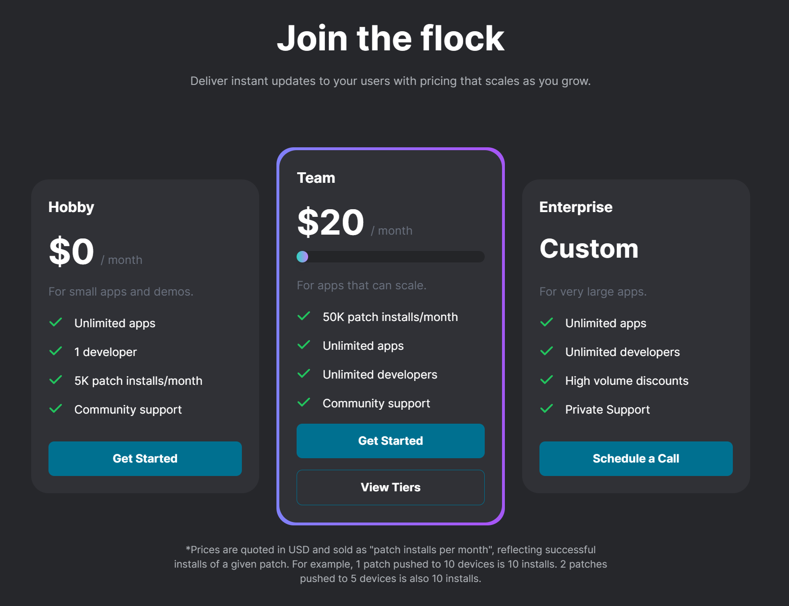

Dart 를 사용해서 앱 개발을 하면 IOS, AOS 로 통일된 디자인으로 배포를 할 수 있다는 장점이 있습니다. 그런데 배포시 심사로 인해 시간이 오래걸린다는 문제가 있습니다. 그런데!!! [Shorebird 서비스](https://shorebird.dev/)에서 제공하는 코드 푸시기능을 이용하면 심사 없이 바로 배포가 가능하다고 합니다. 

하이패스인가요??!! ㄷㄷㄷ 

- [shorebird.dev](https://shorebird.dev/)
- [Flutter 를 위한 Code Push Shorebird 1.0 릴리즈](https://teveloper.tistory.com/75)
- [Flutter 에서 Code Push (1) - Shorebird](https://velog.io/@tksuns12/Flutter%EC%97%90%EC%84%9C-Code-Push-%ED%95%98%EA%B8%B0-1-ShoreBird)

가격은 조금 비쌉니다. 

다만 1인용으로 사용시에는 1달에 5K (5000) 번의 앱 패치는 무료라고 합니다. 

제 생각에는 네이티브 앱 쓴다고 해서 React 같은 SPA 를 아예 안쓸 수는 없을 듯 하며, 페이지마다 필요한 적절한 선택과 조합을 해가는 것이 맞다고 보여서 당분간은 React 도 같이 스터디 해볼렵니다. 

 

위의 이야기와는 다른 이야기지만... 

그런데... 오늘 유튜브를 보다보니 dart 로 웹 서버도 만들수 있다고 합니다ㅋㅋㅋ 

Spring..., Fast API, golang, Node.js.... 헛...  

아직까지는 Spring Cloud 계열의 기술 스택이 제공하는 범용성과 다양성으로 인해 생각은 다른 서버 개발 프레임워크 스터디는 안해보고 있지만, 채팅서버 개발이라든가 이런건 Spring Cloud Discovery 서버에 붙여서 뭔가 해볼 수 있지 않을까? 하는 생각을 잠깐...해봤었다는..... 

