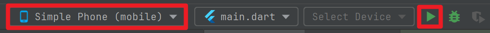

Android 상단의 Device Manager 버튼 클릭


<br/>

또는 아래와 같이 우측의 Device Manager 탭 클릭


<br/>

그리고 `+` 버튼 클릭 후 `Create Virtual Device` 버튼을 클릭합니다.<br/>


Device 를 선택합니다. 제 경우에는 컴퓨터의 발열이 올라가는걸 좋아하지 않아서 가급적 size도 작고 해상도도 낮은 기기를 선택했습니다.


<br/>


원하는 Release 를 선택 후에 다운로드 버튼을 눌러서 다운로드를 완료한 후 `Next` 버튼을 클릭해주세요


다운로드 버튼은 아래와 같은 버튼입니다.


<br/>


AVD Name 은 `Simple Phone` 이라고 입력해줬습니다. `Finish` 를 눌러서 AVD 생성을 마무리합니다.


<br/>


실행시킬 `main.dart` 코드는 아래와 같습니다.

```dart
import 'package:flutter/material.dart';

void main() {
  runApp(MaterialApp(
    home: Scaffold(
      appBar: AppBar(
          actions: [
            IconButton(
                onPressed: () {
                  print("Pressed!!");
                },
                icon: Icon(Icons.play_arrow))
          ],
          title: Center(
            child: Text('Helloworld App Bar'),
          )),
      body: HelloworldWidget(),
    ),
  ));
}

class HelloworldWidget extends StatelessWidget {
  const HelloworldWidget({super.key});

  @override
  Widget build(BuildContext context) {
    return SafeArea(
      child: Center(
        child: Text(
          'Hello, Flutter',
          style: TextStyle(
            color: Colors.blue,
          ),
        ),
      ),
    );
  }
}
```

<br/>


Device 를 실행시킵니다.


<br/>


main.dart 파일 역시 실행시켜줍니다. 이때 Device 는 방금 생성한 `Simple Phone` 을 선택해서 실행합니다.



<br/>


실행화면이 나타나는데 조금 더 큰 화면에서 보고 싶다면 아래에 빨간 테두리로 표시한 버튼을 클릭해주세요.


<br/>


새로운 윈도우에 조금 더 큰 화면으로 앱이 나타났습니다. 빨간색 테두리로 표시한 부분에 위치한 재생 버튼을 클릭해주세요.


<br/>


아래와 같이 `Pressed!!` 라는 문구가 콘솔에 잘 나타난다면 정상입니다.

