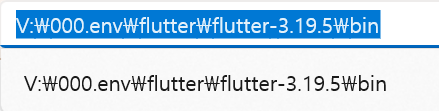
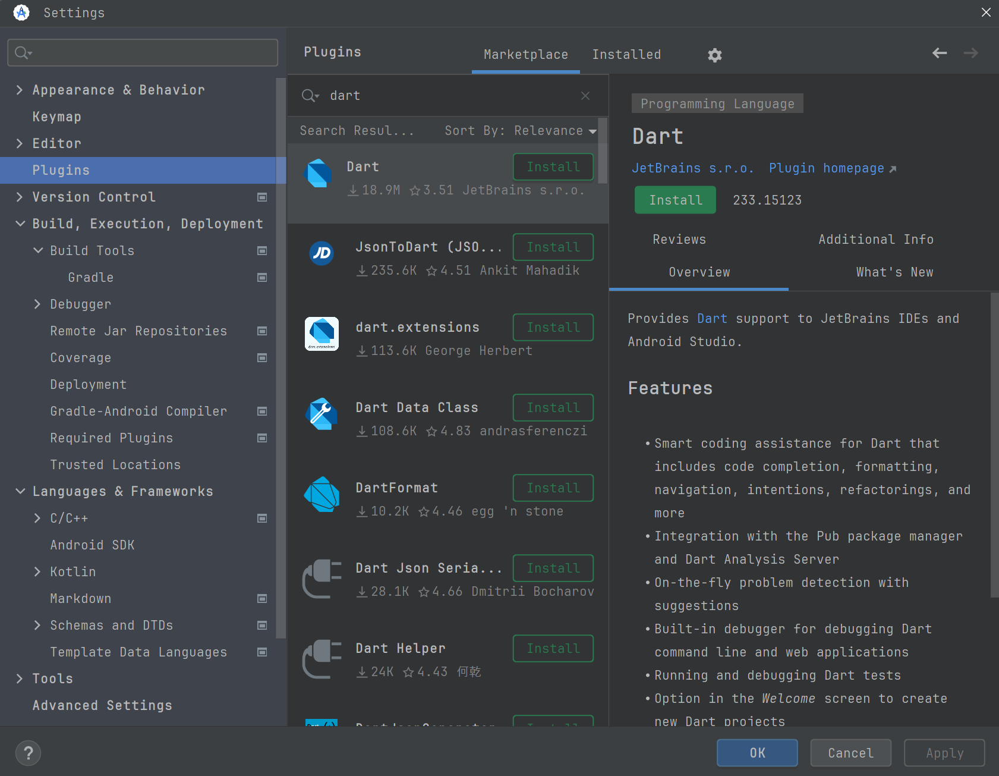
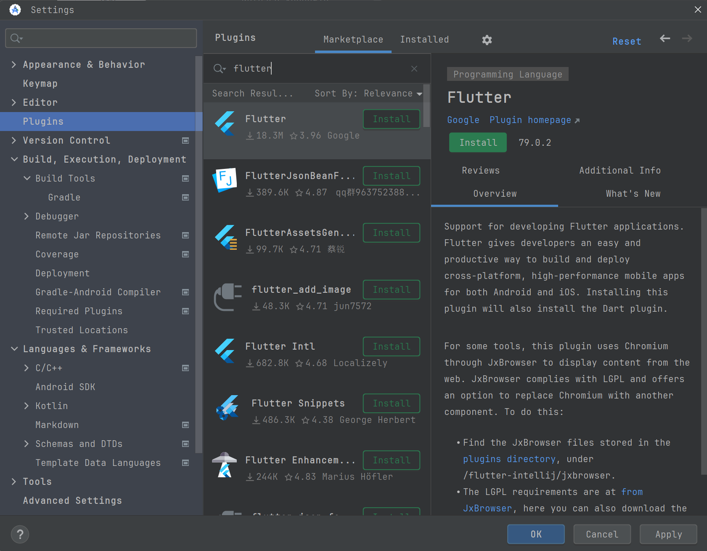
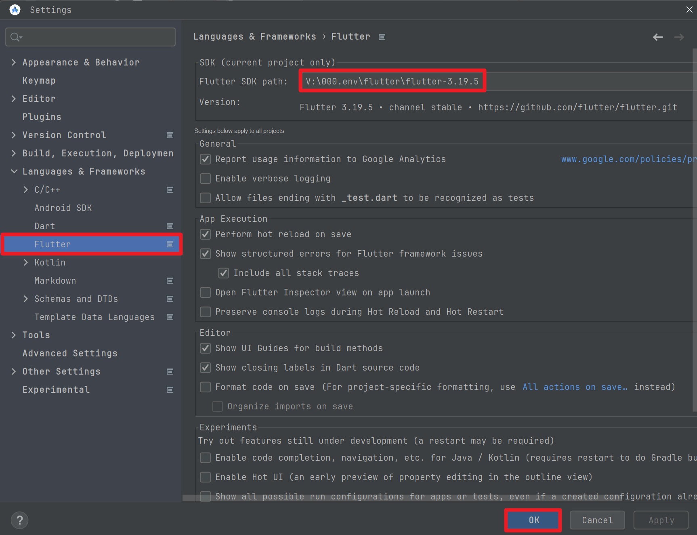
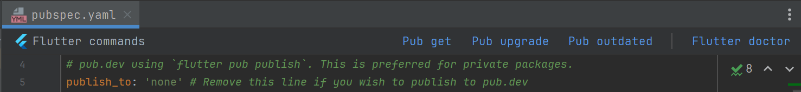

## 설치 & 세팅

## Fluter, Android Studio 설치

> 참고로 Android Studio 는 별도의 라이선스 없이 누구나 사용가능합니다. 

 

## Flutter 설치

Flutter 다운로드 링크는 아래와 같습니다.

- [https://flutter-ko.dev/get-started/install](https://flutter-ko.dev/get-started/install)

 

최신 버전은 3.22 버전이며 3.22 버전으로 다운로드 받아지는데, 여러 버전들을 보관한 저장소는 아래와 같습니다.

- [Flutter SDK Archive](https://docs.flutter.dev/release/archive)

 

다운로드 받은 SDK 를 OS의 환경변수로 등록해주세요. 

이때 주의할 점은 압축을 푼 디렉터리내에서 `bin` 디렉터리를 환경변수로 등록해야 한다는 점입니다. 

 

## Android Studio 설치

구글에서 Android Studio Download 를 검색합니다. 다운로드 링크는 [여기](https://developer.android.com/studio?hl=ko)입니다. 다운로드 받은 후 Android Studio 를 설치해줍니다. 

## Android Studio → Plugins → Dart , Flutter 설치

Dart 설치

 

Flutter 설치

## 샘플 프로젝트 Clone / Download

샘플 프로젝트는 준비해서 따로 올릴 예정입니다. 

## Project SDK 설정

Ctrl + , 또는 Cmd + , 를 눌러서 Settings 화면으로 진입합니다. 그리고 `Languages & Frameworks` 메뉴 내의 `Flutter` 메뉴로 진입합니다.

 

그리고 Flutter SDK Path 에는 압축을 풀었던 flutter 디렉터리를 지정해줍니다. 여기서 주의할 점은 OS의 환경변수로 등록할때 `bin` 을 등록했었지만, Android Studio 의 설정에서의 SDK Path 는 Flutter SDK 디렉터리 자체를 등록해줘야 한다는 점입니다. 

모두 완료되었다면 `OK` 버튼을 클릭해주세요. 

이렇게 설정하고 나면 Dart 언어의 SDK 도 자동으로 세팅됩니다. 

## 의존성 다운로드

Flutter 의 경우 `flutter pub get` 명령어로 의존성을 다운로드 받아줘야 합니다. 그런데 Android Studio 내에서는 `flutter pub get` 명령이 이미 구비되어 있으며 GUI에서 버튼을 누르는 것으로 update 가 가능해집니다. 

위의 pubspec.yaml 파일에서 `Pub get` 버튼을 클릭해서 나머지 의존성들을 모두 다운로드 받아서 설치해주시면 됩니다.

