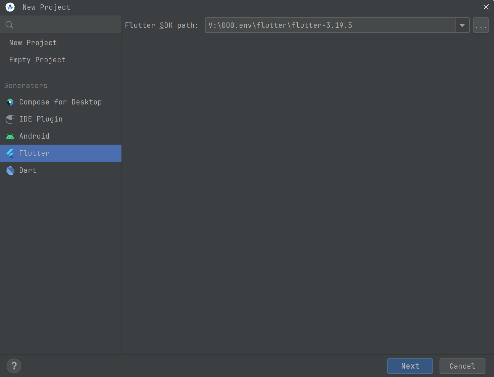

## Helloworld 프로젝트


## Project 개설


<br/>




<br/>


## Project View 로 전환


<br/>


## Start

`lib/main.dart` 와 `test/widget_test.dart` 파일을 모두 열어서 파일 내부의 내용들을 모두 지워줍니다. `lib/main.dart` , `test/widget_test.dart` 파일들은 모두 아래의 위치에 있습니다.

 

<br/>


`lib/main.dart` 와 `test/widget_test.dart` 파일의 내부를 모두 지워주세요.


<br/>


이번에는 아래의 코드를 작성합니다.

```dart
import 'package:flutter/material.dart';

void main(){
  runApp(MaterialApp(
    home: Scaffold(

    ),
  ));
}
```

runApp() 함수

- runApp 함수 내에 MaterialApp 말고도 Cupertino 등 여러가지를 사용할 수 있습니다.

MaterialApp

- 앱의 가장 기본이 되는 단위. 최상위에 위치
- 이번 예제에서는 material.dart 내의 runApp() 함수를 사용하기에 MaterialApp 객체를 사용합니다.

Scaffold

- MaterialApp 에서 화면을 구성할 때 가장 기본이 되는 도화지같은 개념입니다.

<br/>


> runApp() 함수는 MaterialApp 객체를 입력으로 받는 함수를 선택하시기 바랍니다.
>
> 

<br/>


이제 위의 코드를 구동시키면 아래와 같은 화면이 나타납니다. 이번 예제에서는 별도의 Device Manager 를 선택하지 않았기 때문에 웹에서 그 내용이 나타납니다.


<br/>


디버그 모드에서 띄웠기에 Debug 라는 표시가 나타납니다.


이번에는 아래와 같이 `body: Text(...)` 을 추가해줍니다.

```dart
import 'package:flutter/material.dart';

void main(){
  runApp(MaterialApp(
    home: Scaffold(
      body: Text('Hello, Flutter', style: TextStyle(
        color: Colors.blue,
      ),),
    ),
  ));
}
```

<br/>


위의 코드에서 Ctrl + Alt + L 또는 Cmd + Alt + L 을 누르면 아래와 같이 들여쓰기가 됩니다.

```dart
import 'package:flutter/material.dart';

void main() {
  runApp(MaterialApp(
    home: Scaffold(
      body: Text(
        'Hello, Flutter',
        style: TextStyle(
          color: Colors.blue,
        ),
      ),
    ),
  ));
}
```

<br/>


별도로 Run 버튼을 새로 누르지 않더라도 새로고침이 되며, 출력결과는 아래와 같습니다.


<br/>


이번에는 위젯을 추가해봅니다. 방금전 추가했던 Text 컴포넌트 위에 Alt + Enter 키를 누르면 여러가지 선택지가 나타나는데 이 중에서 `Wrap with widget ...` 을 선택해줍니다. 


<br/>


그리고 SafeArea 를 선택해줍니다.


<br/>


완성된 코드는 아래와 같습니다.

```dart
import 'package:flutter/material.dart';

void main() {
  runApp(MaterialApp(
    home: Scaffold(
      body: SafeArea(
        child: Text(
          'Hello, Flutter',
          style: TextStyle(
            color: Colors.blue,
          ),
        ),
      ),
    ),
  ));
}
```

<br/>


## 코드 분리

이번에는 코드를 분리해봅니다. 에디터 하단의 공백에 `stless` 를 입력하면 Stateless Widget 의 기본 코드가 Live Template 을 통해서 나타납니다.


<br/>


그리고 만들어진 Stateless Widget 에는 build 함수 내에 방금전 작성했던 SafeArea 코드를 리턴하도록 작성해줍니다.

```kotlin
import 'package:flutter/material.dart';

void main() {
  runApp(MaterialApp(
    home: Scaffold(
      body: SafeArea(
        child: Text(
          'Hello, Flutter',
          style: TextStyle(
            color: Colors.blue,
          ),
        ),
      ),
    ),
  ));
}

class HelloworldWidget extends StatelessWidget {
  const HelloworldWidget({super.key});

  @override
  Widget build(BuildContext context) {
    return SafeArea(
      child: Text(
        'Hello, Flutter',
        style: TextStyle(
          color: Colors.blue,
        ),
      ),
    );
  }
}
```

<br/>


그리고 HelloworldWidget 을 main() 에서 사용하도록 아래와 같이 수정해줍니다.

```dart
import 'package:flutter/material.dart';

void main() {
  runApp(MaterialApp(
    home: Scaffold(
      /// (1) : 이 부분을 수정해줬습니다.
      body: HelloworldWidget(),
    ),
  ));
}

// (2)
class HelloworldWidget extends StatelessWidget {
  const HelloworldWidget({super.key});

  @override
  Widget build(BuildContext context) {
    return SafeArea(
      child: Text(
        'Hello, Flutter',
        style: TextStyle(
          color: Colors.blue,
        ),
      ),
    );
  }
}
```

<br/>


- (1) : 원래 있던 코드 들을 (2) 에서 작성한 클래스 내의 build() 메서드 안으로 옮겨주었고, (2) 에서 작성한 위젯을 불러오도록 작성했습니다.

<br/>


## Text 위젯을 Center 위젯으로 한번 더 감싸기

Text 의 위치를 정 중앙에 위치하도록 해봅니다.<br/>

위에서 작성한 HelloworldWidget 에 Alt + Enter 키를 누르면 추천이 나타나는데 그 중 `Wrap With Center` 를 선택해줍니다.


<br/>


그러면 코드가 아래와 같이 잘 적용됩니다.

```dart
import 'package:flutter/material.dart';

void main() {
  runApp(MaterialApp(
    home: Scaffold(
      body: HelloworldWidget(),
    ),
  ));
}

class HelloworldWidget extends StatelessWidget {
  const HelloworldWidget({super.key});

  @override
  Widget build(BuildContext context) {
    return SafeArea(
      child: Center(
        child: Text(
          'Hello, Flutter',
          style: TextStyle(
            color: Colors.blue,
          ),
        ),
      ),
    );
  }
}
```

<br/>


변경된 화면은 아래와 같습니다.

