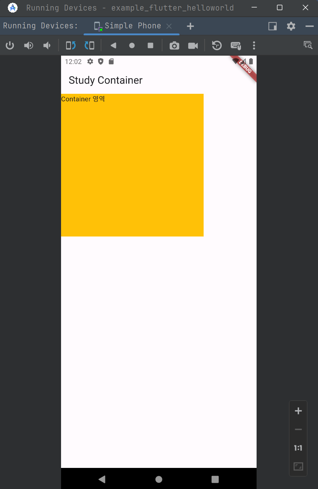
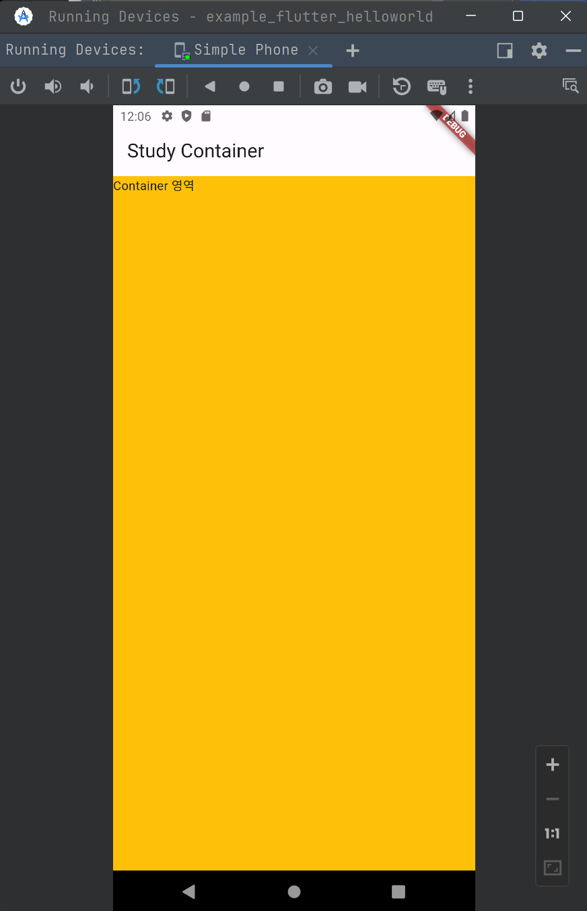

- MatiralApp, Scaffold widget
- Container, Center widget

<br/>


## MaterialApp Widget

> 참고 : [api.flutter.dev - MaterialApp class](https://api.flutter.dev/flutter/material/MaterialApp-class.html)

[api.flutter.dev - MaterialApp class](https://api.flutter.dev/flutter/material/MaterialApp-class.html) 에서는 MaterialApp 내의 인자값에 대해서 아래와 같이 설명하고 있습니다.

The [MaterialApp](https://api.flutter.dev/flutter/material/MaterialApp-class.html) configures the top-level [Navigator](https://api.flutter.dev/flutter/widgets/Navigator-class.html) to search for routes in the following order:

1. For the `/` route, the [home](https://api.flutter.dev/flutter/material/MaterialApp/home.html) property, if non-null, is used.
2. Otherwise, the [routes](https://api.flutter.dev/flutter/material/MaterialApp/routes.html) table is used, if it has an entry for the route.
3. Otherwise, [onGenerateRoute](https://api.flutter.dev/flutter/material/MaterialApp/onGenerateRoute.html) is called, if provided. It should return a non-null value for any *valid* route not handled by [home](https://api.flutter.dev/flutter/material/MaterialApp/home.html) and [routes](https://api.flutter.dev/flutter/material/MaterialApp/routes.html).
4. Finally if all else fails [onUnknownRoute](https://api.flutter.dev/flutter/material/MaterialApp/onUnknownRoute.html) is called.

<br/>


이 외에도 [Properties](https://api.flutter.dev/flutter/material/MaterialApp-class.html#instance-properties) 섹션을 보면 다양한 인자값에 대해 설명하고 있습니다.<br/>


home

- 앱을 제일 처음 실행했을 때 진입하는 기본 route 를 home 이라고 이야기합니다.

routes

- 앱 내에서 화면이 이동될 때 이동될 경로를 route 라고 이야기합니다.

color, theme

- color 또는 theme 을 지정해줄 수 있습니다.
- 일반적으로 theme 객체를 지정해서 통일성을 부여합니다.

<br/>


## Scaffold Widget

Scaffold 는 앱을 구성할 때 쓰이는 도화지(캔버스) 같은 존재입니다. <br/>

e.g.

```dart
import 'package:flutter/material.dart';

void main() {
  runApp(MaterialApp(
    home: Scaffold(
      appBar: AppBar(
          actions: [
            IconButton(
                onPressed: () {
                  print("Pressed!!");
                },
                icon: Icon(Icons.play_arrow))
          ],
          title: Center(
            child: Text('Helloworld App Bar'),
          )),
      body: HelloworldWidget(),
    ),
  ));
}

class HelloworldWidget extends StatelessWidget {
  const HelloworldWidget({super.key});

  @override
  Widget build(BuildContext context) {
    return SafeArea(
      child: Center(
        child: Text(
          'Hello, Flutter',
          style: TextStyle(
            color: Colors.blue,
          ),
        ),
      ),
    );
  }
}
```

Scaffold 내에 appBar, body 를 추가해줬습니다.<br/>


위의 실행 결과는 아래와 같습니다.


Scaffold 위젯은 위의 그림에서 빨간 테두리에 표시한 영역에 해당합니다. 마치 캔버스 같은 영역입니다.<br/>

이번에는 우측 상단의 재생버튼을 눌러보시기 바랍니다.


<br/>


그러면 아래와 같은 문구들이 콘솔에 나타납니다.


<br/>


## Container Widget

먼저 아래의 dart 코드를 작성해주세요.<br/>

**`container_example.dart`**

```dart
import 'package:flutter/material.dart';

void main(){
  runApp(MaterialApp(
    home: Scaffold(
      appBar: AppBar(
        title: Text('Study Container'),
      ),
      body: CustomContainer(),
    ),
  ));
}

class CustomContainer extends StatelessWidget {
  const CustomContainer({super.key});

  @override
  Widget build(BuildContext context) {
    return Container(
      width: 300,
      height: 300,
      color: Colors.amber,
      child: Text('Container 영역'),
    );
  }
}
```

<br/>


이렇게 작성한 코드의 결과물을 돌려보면 아래와 같은 결과가 나타납니다. 300x300 사이즈의 컨테이너가 생성되었습니다.



<br/>


이번에는 컨테이너의 가로, 세로를 모두 채워보겠습니다. 아래의 코드로 수정해주세요.

Container 위젯의 width, height 을 모두 `double.infinity` 로 지정해주었습니다.<br/>

**`container_example.dart`**

```dart
import 'package:flutter/material.dart';

void main(){
  runApp(MaterialApp(
    home: Scaffold(
      appBar: AppBar(
        title: Text('Study Container'),
      ),
      body: CustomContainer(),
    ),
  ));
}

class CustomContainer extends StatelessWidget {
  const CustomContainer({super.key});

  @override
  Widget build(BuildContext context) {
    return Container(
      width: double.infinity, // 변경
      height: double.infinity, // 변경
      color: Colors.amber,
      child: Text('Container 영역'),
    );
  }
}
```

<br/>


출력결과는 아래와 같습니다.



<br/>


이번에는 배경을 조금 투명하게 만들어봅니다. color 항목에 대해 `Colors.amber.shade200` 으로 지정해줬습니다.<br/>


**`container_example.dart`**

```dart
import 'package:flutter/material.dart';

void main(){
  runApp(MaterialApp(
    home: Scaffold(
      appBar: AppBar(
        title: Text('Study Container'),
      ),
      body: CustomContainer(),
    ),
  ));
}

class CustomContainer extends StatelessWidget {
  const CustomContainer({super.key});

  @override
  Widget build(BuildContext context) {
    return Container(
      width: double.infinity,
      height: double.infinity,
      color: Colors.amber.shade200, // 변경한 부분
      child: Text('Container 영역'),
    );
  }
}
```

<br/>


출력결과는 아래와 같습니다.


<br/>


이번에는 색상을 직접 지정해줘보겠습니다.

에디터의 왼쪽에 보이는 색상 아이콘을 클릭하면 팝업이 나타나는데, 원하는 색상을 포인터로 선택 후에 Hex 값을 복사합니다.


색상 코드를 복사한 후 아래와 같이 코드를 수정해주세요.


**`container_example.dart`**

```dart
import 'package:flutter/material.dart';

void main(){
  runApp(MaterialApp(
    home: Scaffold(
      appBar: AppBar(
        title: Text('Study Container'),
      ),
      body: CustomContainer(),
    ),
  ));
}

class CustomContainer extends StatelessWidget {
  const CustomContainer({super.key});

  @override
  Widget build(BuildContext context) {
    return Container(
      width: double.infinity,
      height: double.infinity,
      color: Color(0xFF9AEC67), // 여기를 수정했습니다.
      child: Text('Container 영역'),
    );
  }
}
```

색상 팔레트에서 복사한 값은 `9AEC67FF` 였습니다. 여기에서 아래와 같이 변경해서 적용했습니다.

- 맨 앞에 `0x` 를 붙입니다 : `0x9AEC67FF`

- 맨 뒤의 `FF` 를 제거합니다 : `0x9AEC67`
-  `0x` 의 바로 뒤에 `FF` 를 붙여줍니다 : `0xFF9AEC67` 

<br/>


색상 코드의 각 자리수는 아래와 같은 의미를 가집니다.

- 0x\[투명도 2자리\]\[Red 표현 2자리\]\[Green 표현 2자리\]\[Blue 표현 2자리\]

<br/>


위의 코드는 아래와 같이 출력됩니다.


<br/>


이번에는 padding, margin 을 지정해봅니다.

**`container_example.dart`**

```dart
import 'package:flutter/material.dart';

void main(){
  runApp(MaterialApp(
    home: Scaffold(
      appBar: AppBar(
        title: Text('Study Container'),
      ),
      body: CustomContainer(),
    ),
  ));
}

class CustomContainer extends StatelessWidget {
  const CustomContainer({super.key});

  @override
  Widget build(BuildContext context) {
    return Container(
      width: double.infinity,
      height: double.infinity,
      color: Color(0xFF9AEC67),
      padding: EdgeInsets.fromLTRB(30, 50, 30, 5),
      child: Text('Container 영역'),
    );
  }
}
```

왼쪽에서 30px, 위에서 50px 의 빈 공간의 간격(padding)을 두고 child 를 배치하게 됩니다. 이 외에도 right, bottom 을 지정했는데, 내용물의 길이가 길지 않기에 넘쳐나지 않게 되어서 이번 출력물에서는 확인은 불가능하지만, right, bottom 에도 padding 을 각각 지정해둔 상태입니다.<br/>


<br/>


이번에는 margin 을 수정하는 코드를 작성해봅니다.

먼저 테스트를 위해 아래와 같이 Container 영역을 줄여주는 코드를 작성합니다.

**`container_example.dart`**

```dart
import 'package:flutter/material.dart';

void main(){
  runApp(MaterialApp(
    home: Scaffold(
      appBar: AppBar(
        title: Text('Study Container'),
      ),
      body: CustomContainer(),
    ),
  ));
}

class CustomContainer extends StatelessWidget {
  const CustomContainer({super.key});

  @override
  Widget build(BuildContext context) {
    return Container(
      width: 300,
      height: 300,
      color: Color(0xFF9AEC67),
      padding: EdgeInsets.fromLTRB(30, 50, 30, 5),
      child: Text('Container 영역'),
    );
  }
}
```

<br/>


출력결과는 아래와 같습니다.


<br/>


이제 위에 나타난 초록색 영역을 Scaffold 내에서 약간의 간격을 두고 떨어지도록 설정하는 코드를 작성해봅니다. 코드는 아래와 같습니다.

**`container_example.dart`**

```dart
import 'package:flutter/material.dart';

void main(){
  runApp(MaterialApp(
    home: Scaffold(
      appBar: AppBar(
        title: Text('Study Container'),
      ),
      body: CustomContainer(),
    ),
  ));
}

class CustomContainer extends StatelessWidget {
  const CustomContainer({super.key});

  @override
  Widget build(BuildContext context) {
    return Container(
      width: 300,
      height: 300,
      color: Color(0xFF9AEC67),
      padding: EdgeInsets.fromLTRB(30, 50, 30, 5),
      margin: EdgeInsets.symmetric(vertical: 120, horizontal: 50),
      child: Text('Container 영역'),
    );
  }
}
```

vertical :120

- 수직(상하) 간격으로 120 의 공간을 배치해서 떨어뜨려 줍니다.

horizontal : 50

- 수평 (좌우) 간격으로 50 의 공간을 배치해서 떨어뜨려 줍니다.

<br/>


변경된 결과물은 아래와 같습니다.


<br/>


## Center Widget


